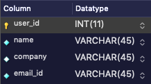
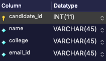
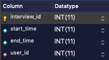
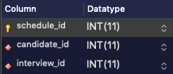

# IB Backend Server

## Specs

- Nodes.js
- Express
- Mysql

## Database Schema-

### **Tables** -

- USER

  - This table consists of all the users who can create the interviews(i.e table for interviewer's information)

    

- CANDIDATE

  - This table consist of details of candidates

    

- INTERVIEW

  - This table consists of information about interviews scheduled by the USER. Foreign key - user_id

    

- SCHEDULE

  - This table consists the interview - candidate relationship as many candidates can sit in same interview. Foreign key - candidate_id, interview_id

    
